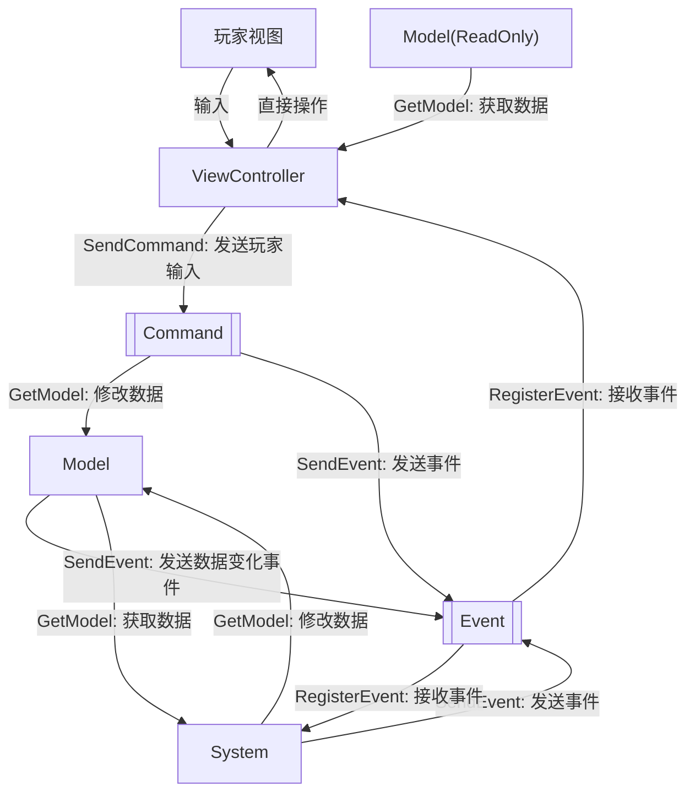

# SoyoFramework

本文档介绍SoyoFramework核心框架的使用，如果想了解其他部分内容，请移步根目录下的README.md。

## 快速简介

SoyoFramework是一个基于MVC设计模式的Unity游戏开发框架。

设计哲学：

- 低耦合，可扩展
- 架构思路优先于硬性规范
    - 允许不符合规范的代码存在，并提供标记手段
- 自然制作流程优先于一切

## 核心框架介绍

### 层级介绍

一共有以下概念：

- 三个层级：Model, System, ViewController
- 两种通信方式：Event, Command
- 一种逻辑封装工具：Tool

架构运行如下图所示（箭头为信息传输方向）：

#### 层级划分

##### 数据层

**Model**：**存储全局数据，提供数据变更事件**。

- 设计意图：
    - 作为数据的容器，存放全局共享的数据
    - 封装数据的加载存储方法
- 职能：
    - SendEvent

> 允许在Model里提供Action(或者用框架内置的EasyEvent/BindableProperty)，认为这是SendEvent的语法糖。

> 不过存在*不允许订阅事件但能获取Model*的层级，此处只能靠自觉约束不订阅事件。

##### 逻辑层

**System**：**处理数据层面的逻辑**。

- 设计意图：
    - 逻辑的处理中心
- 职能：
    - GetModel
    - SendEvent
    - RegisterEvent

##### 表现层

**ViewController**：**将数据呈现给玩家，接受玩家输入，处理简单的逻辑**。

分为两种：

- MonoVController：继承自MonoBehavior，使用Unity生命周期，无需注册到框架
- ViewController：注册到框架使用

- 设计意图：
    - 将数据转化为表现
    - 接受玩家输入
    - 处理简单的逻辑，减少System封装压力
- 职能：
    - GetModel (但不能修改Model数据，靠自觉实现)
    - RegisterEvent
    - SendCommand

> 如果你觉得*靠自觉不修改Model*不好，请使用内置Tool:ViewModel。
> 不过经过实践检验，这个封装不必要。

> 这个层级本质上耦合了Controller和View层，经过实践检验这么做是合理的。
> 因为游戏编程要处理的小逻辑太多了，如果都放在System里，System数量会暴增。

#### 通信方式

**Event**：

- 通信方向：低 => (高 or 同级)
- 基于TypeEventSystem实现

**Command**：

- 通信方向：ViewController => Model & System
- 职能：
    - GetModel
    - SendEvent
    - SendCommand

> 设定上，Command与System处于同一层级，它们的唯一区别是：Command不能RegisterEvent

> 提出这个层级，是为了限制ViewController向下通信的能力。原则上：ViewController只能通过SendCommand向下层通信

#### 逻辑封装工具: Tool

- 定义：依赖于三个层级的某一个，提供逻辑的封装
- 约束：
    - Tool的职能不能超过依赖的层级
    - Tool不能存在状态

> 设计这个东西的初衷是解决烦人的依赖注入

#### 违反规范

SoyoFramework的设计哲学是“架构思路优先于硬性规范”，因此允许存在违反规范的代码。

框架提供了以下特性来标记违反规范的代码：
- SuperLayer: 标记一个层级具有超越层级的职能
- HasBetterArch: 标记一个类的设计存在更好的架构方案，但由于某些原因暂时没有重构。需要明确指出重构思路
- BelongsToLayer: 标记难以整合进框架的代码应该属于哪个层级。有此标记代表无需重构

> 未来会制作分析违规代码的Editor工具，敬请期待

### 杂项

#### Command分析工具

Command是以类为单位的，每次发送Command，都会创建一个Command对象。
因此频繁发送Command，可能会引起GC压力。
Command分析工具正是为解决这个问题而设计。

- 功能：
    - 以Command类为单位，统计总发送次数
    - 以Command类为单位，统计每1s内发送次数峰值
- 使用方式：
    - 打开窗口：SoyoFramework/CommandProfiler

## 杂项 / 随笔

### EasyEvent V.S. TypeEventSystem

EasyEvent 特指存储在Model里的Event，TypeEventSystem 指全局的事件系统。

从“代码能跑”的角度来看，它们其实是等价的：

- 能RegisterEvent的层级，都能获取Model
- 能获取Model的层级，都能RegisterEvent

因此如果禁止Model存储EasyEvent，反而会让框架更规范。

本质上说，Model里的EasyEvent算是一个语法糖，用于区分事件的设计意图：

- EasyEvent 更倾向是：数据变化的客观反映
- TypeEventSystem 更倾向是：某个行为的发生

而BindableProperty则是EasyEvent的语法糖，本质是**属性+EasyEvent**的结合体。

此外，EasyEvent的性能更好一些。

## 该部分建设中

### 重要理解记录

ECA金句：**没有接收到信息，那就不该有任何代码执行**。