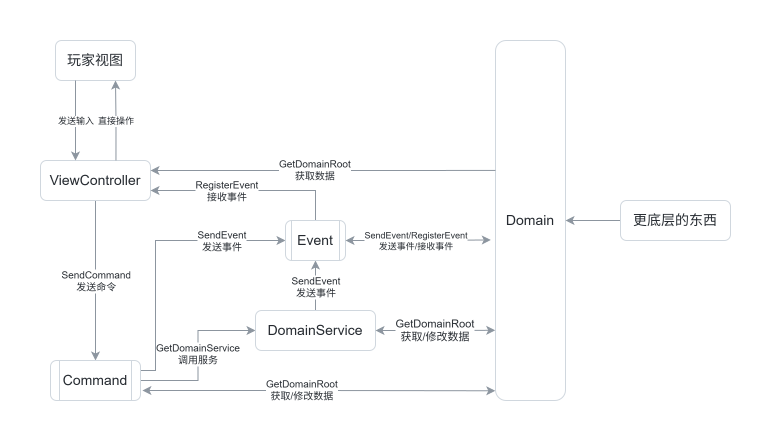

还在开发中，README可能不适用。

# SoyoFramework

本文档介绍SoyoFramework核心框架的使用，如果想了解其他部分内容，请移步[INDEX.md](./INDEX.md)。

## 快速简介

SoyoFramework 是一个适用于单机游戏开发的实验性 Unity 框架。

- 主要是提供架构设计指引，而不是功能的打包。
- 使用新颖的架构理念（融合了MVVM和DDD的部分设计精髓）。

设计哲学：

- 代码结构描述业务需求
- 架构思路优先于硬性规范
    - 允许不符合规范的代码存在，并提供标记手段
- 行为与表现分离
    - 但是行为应该与引擎耦合
- 推荐观察者模式
- 自然制作流程优先于一切规范

## 架构介绍

#### 架构运行速览

1. 用户与`ViewController`交互，产生输入。
2. `ViewController`将输入封装为`Command`，发送`Command`。
3. `Command`内部包含逻辑，与`Domain`交互。有时会调用`DomainService`。
4. `Domain`进行本地的逻辑运算，修改自己的数据。
5. `ViewController`订阅`Domain`的数据变化事件，更新表现。

### 层级介绍

一共有以下概念：

- Domain, DomainService, ViewController, Command, Event

架构运行如下图所示（箭头为信息传输方向）：

> 注意：箭头方向是信息传输方向，而不是调用方向。



#### 数据逻辑层

##### Domain

**Domain：存储全局数据，运算绝大部分游戏逻辑**

- 设计意图：
    - 作为数据的容器，存放全局共享的数据
    - 处理游戏逻辑运算
    - 提供可读性良好的数据结构
- 职能：
    - SendEvent
    - RegisterEvent
    - 与更底层的系统交互（存档系统、网络系统等）

> 允许在Domain中提供 Action/EasyEvent/BindableProperty，以实现观察者模式。

> 这里提到的 EasyEvent 和 BindableProperty
> 是框架提供的工具，详见：[EasyEvent / BindableProperty](#easyevent--bindableproperty)

Domain 以 DomainRoot + DomainEntity 的形式存在。

DomainRoot 是 Domain 与外部交互的接口，外部通过 GetDomainRoot 获取 DomainRoot 实例，进而访问 Domain。

DomainEntity 是 Domain 的数据容器，封装可读性良好的 api，被 DomainRoot 持有。
DomainEntity 可以是一个类，也可以是 MonoBehavior。

> 不建议 DomainRoot 继承 MonoBehavior，DomainEntity 则无所谓。

> 想要使用 Domain 优雅地写代码，请见：
[编写 Domain 类最佳实践](#编写-domain-类最佳实践)

---

##### DomainService

**DomainService：处理跨 Domain 的逻辑**

- 设计意图：
    - 处理跨 Domain 的逻辑
- 职能：
    - GetDomainRoot
    - SendEvent
    - GetDomainService
    - RegisterDomainRoot
    - UnregisterDomainRoot

> DomainService 不应存在状态。

> 这是一个长时间存在的类，框架初始化时创建，框架析构时销毁。

---

#### 表现逻辑层

##### Command

**Command：封装 ViewController 的输入，向下层传递信息**

- 设计意图：
    - 封装 ViewController 的输入，向下层传递信息
    - 对输入进行验证，及时屏蔽错误的输入
    - 如果需要，可以负责少量的表现层逻辑
- 职能：
    - SendCommand
    - GetDomainRoot
    - GetDomainService
    - SendEvent
    - RegisterDomainRoot
    - UnregisterDomainRoot

> Command 是以类为单位的，每次发送 Command，都推荐创建一个 Command 对象。
> （你也可以不这么做，但是 Command 以构造函数作为传参方式，复用 Command 容易导致问题）

> Command 是 ViewController 操作 Domain 的唯一途径。

> Command 的职能大于 DomainService，但它们的设计意图相差很大。

---

##### ViewController

**ViewController：将数据呈现给玩家，接受玩家输入，处理简单的逻辑**。

分为两种：

- MonoVController：继承自 MonoBehavior，使用 Unity 生命周期。
- VController：注册到框架使用，具有与 DomainRoot 类似的生命周期。

- 设计意图：
    - 将数据转化为表现
    - 将玩家输入封装为 Command 发送
    - 处理表现层逻辑
- 职能：
    - GetDomainRoot (约定：只读)
    - SendCommand
    - RegisterEvent

---

#### Event

**Event：事件机制，允许跨层级通信**

- 基于 TypeEventSystem 实现

---

### 违反规范

SoyoFramework 的设计哲学是“架构思路优先于硬性规范”，允许代码(少量地)违反规范。

推荐使用如下方式标记：

```csharp

// 使用 "bad: ", "better: " 来标记违反规范的代码。配合TODO插件实现高亮以及查找。
// 举例：

public void OnClickButton()
{
    // bad: 直接调用了 DomainRoot 的方法
    // better: 通过 Command 发送请求
    GetDomainRoot<SomeDomainRoot>().DoSomething();
}

```

### Command分析工具

Command是以类为单位的，每次发送Command，都会创建一个Command对象。
因此频繁发送Command，可能会引起GC压力。
Command分析工具正是为解决这个问题而设计。

- 功能：
    - 以Command类为单位，统计总发送次数
    - 以Command类为单位，统计每1s内发送次数峰值
- 使用方式：
    - 打开窗口：SoyoFramework/CommandProfiler

## 杂项

### 最佳实践

#### 代码结构

```text

Assets
├── Editor                         // 存放编辑器脚本
└── Scripts
    └── Backend                    // 存放纯逻辑代码
        ├── ValueObjects             // 不可变类型
        ├── Domains                  // DomainRoot + DomainEntity
        ├── DomainServices           // DomainService
        ├── Events                   // Event
        ├── Gameplay                 // 其余逻辑类（比如配置、游戏相关算法类）
        ├── Utils                    // 工具类
        ├── <其他文件夹>
        └── <游戏名称>.cs             // Architecture类的定义
    └── Presentation               // 存放表现层代码
        ├── Commands                 // Command
        ├── ViewControllers          // ViewController
        ├── Utils                    // 工具类
        └── <其他文件夹>
```

> Backend 和 Presentation 建议分成两个程序集，因为新手很容易在 Domain 中访问 Presentation 的类。

#### 编写 Event 类

1. 总是使用 class，而不是 struct。
2. 添加 After 或 Before 前缀，明示事件触发的时间点。
    - 如果时间点不明确，使用 On 前缀。
    - 不要使用后缀 Event。

#### 编写 Domain 类

> 概念上，DomainRoot 是特殊的 DomainEntity。

1. DomainRoot 是与外界交互的接口，外界对 DomainRoot 进行读写。
    - DomainRoot 提供 DomainEntity 的引用，外界可以直接读写 DomainEntity。
    - DomainEntity 完全为了 api 美观和暗示层次结构，不要在意耦合！
    - 一个 DomainEntity 只属于一个 DomainRoot。即便 Entity 的功能能完美适配另一个 Root，也不要让它属于另一个 Root。
2. 同一个 DomainRoot 内部耦合。
    - DomainEntity 通过 DomainEntity.Root 获取 DomainRoot 的引用。
    - 同一个 Domain 中，DomainEntity 可以持有其他 DomainEntity 的引用。
    - DomainEntity 尽量不访问父 DomainEntity。
3. 不同 DomainRoot 之间不耦合。
    - 禁止获取其他 DomainRoot 的引用，也禁止获取其他 DomainEntity 的引用。
    - 如果你不得不访问其他 Domain，意味着*这两个 Domain 或许可以合并成一个*。
    - 如果你偶尔需要执行跨 Doamin 的操作，请使用 DomainService。
3. DomainRoot 应当保持 api 简洁。
    - 如果逻辑复杂，功能太多，使用 EntityProperty\<T\> 或 DomainEntity\<T\> 来封装。
    - EntityProperty\<TEntity\> 语义：我是 TEntity 的一个成员，属于 TEntity 的一部分。
        - EntityProerty\<T\> 是一个很简单的类，推荐你去看它的实现。
        - EntityProperty\<TEntity\> 通常是嵌套类。利用嵌套类能访问父类的私有成员的特性，封装逻辑。
    - DomainEntity\<T\> 语义：我是该 Domain 内的一个独立的实体，拥有自己的逻辑和数据。
        - 有明确的功能边界，提供可读性良好的 API，尽量不暴露内部数据结构。
        - 尽量不要访问父 Entity。
        - DomainEntity 可以作为 MonoBehavior 存在。
4. DomainEntity 提供的事件不应被外部触发。

#### 编写 DomainService 类

1. DomainService 不应存在状态。
2. 不涉及跨 Domain 的逻辑时，不应使用 DomainService。

#### 编写 Command 类

1. Command 尽量不负责表现层逻辑。
2. 重写 CanExecute 方法来验证输入的合法性。

#### 编写 ViewController 类

1. 永远不要直接修改 Domain 层的内容，应该通过 Command 来修改。
2. 尽量使用观察者模式，少用轮询。

### EasyEvent / BindableProperty

##### EasyEvent

涉及事件的概念时，推荐使用 EasyEvent 代替 event/delegate，因为 EasyEvent 有如下优势：

1. 使用 .Register() 注册，返回一个 IUnRegister，调用 IUnRegister.UnRegister() 即可注销事件。
    - 可以使用 UnRegisterGroup 将多个 IUnRegister 绑定在一起，统一注销。
2. 注册多个回调时，某个回调抛出异常不会影响其他回调的执行。
    - 这个机制会降低性能，不适合性能敏感场景

##### BindableProperty

BindableProperty<T> 是一个数据封装器，每次修改时会触发事件。

- 使用 BindableProperty<T>.Value 获取和修改数据。
- 使用 BindableProperty<T>.Register() 注册事件，这也会返回一个 IUnRegister。（也同样有性能问题）